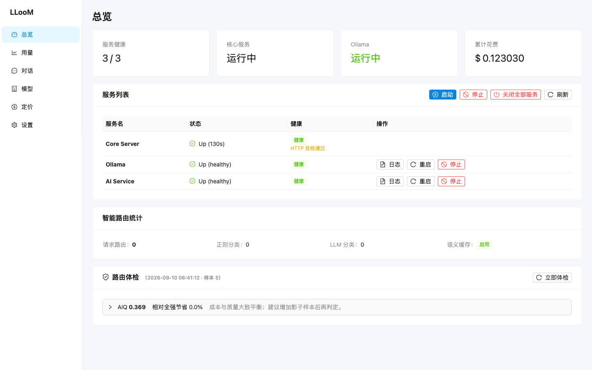

<p align="center">
  
</p>

<h1 align="center">LLooM</h1>

<p align="center">
  自托管的 LLM 路由网关 —— 一个 Rust 二进制搞定模型路由、成本核算、语义缓存与安全过滤。<br/>
  <strong>零 Docker、零外部数据库，克隆即跑。</strong>
</p>

<p align="center">
  
  
  
  
  
  
</p>

<p align="center">
  <a href="README.md">English</a> | <strong>中文</strong>
</p>

<p align="center">
  
</p>

---

## 为什么选择 LLooM?

| 痛点 | LLooM 方案 |
|------|-----------|
| 多模型切换靠感觉 | **评分路由** — 正则 + LLM 两层分类，成本/质量加权 `plan()` 按任务自动选性价比最优模型 |
| API 账单不可控 | **预算档联动路由** — normal/throttle/tight/protect 自动降级，protect 强制零成本本地兜底 |
| 价格不透明 | **多源定价** — manual > remote > packaged > heuristic 优先级链，探针实测 + OpenRouter 参考价交叉核对 |
| 重复问题反复付费 | **语义缓存** — 向量相似度命中直接返回缓存，零成本回复 |
| 复杂任务压垮单模型 | **任务编排** — 自动拆解、按子任务分派模型、按序执行、汇总结果 |
| "healthy" 未必健康 | **诚实状态** — 真实探测区分 Down / 端口冲突 / 未配置，绝不伪装绿灯 |

## 快速开始

**方式 A — 下载发布包**

1. 从 [Releases](https://github.com/citrus-dot/LLooM/releases) 下载最新构建（或安装 `.deb`/`.rpm`）
2. 在 设置 → API 密钥 中填入密钥
3. 打开 `http://localhost:7861` 开始聊天

**方式 B — 源码运行**

```bash
git clone -b v2 https://github.com/citrus-dot/LLooM.git
cd LLooM

uv sync --extra dev --extra build          # 或: pip install -e ".[dev]"
cp .env.example .env                       # 至少填入一个 API 密钥
cd webui && npm install && npm run build && cd ..

cargo run -p lloom-server                  # WebUI 在 :7861
```

服务器（`:7861`）是唯一入口，会自动拉起 Python AI 微服务（`:7862`）和 Ollama（`:11434`）。Ollama 不随包分发，安装：`curl -fsSL https://ollama.com/install.sh | sh`。

## 30 秒上手

**WebUI** — 打开 [http://localhost:7861](http://localhost:7861)：服务状态、聊天、模型、用量、定价、设置。

**CLI**

```bash
lloom-cli chat "解释一下快速排序"           # 单次提问，自动路由
lloom-cli usage                            # 按模型查看花费
lloom-cli status                           # 服务 + 路由统计
```

**REST API** — OpenAI 风格流式：

```bash
curl -N -X POST http://localhost:7861/api/chat/stream \
  -H "Content-Type: application/json" \
  -d '{"q": "解释一下快速排序"}'
```

## 功能特性

- **智能路由** — 两层分类（正则 → LLM 兜底）；注册表门槛 + 健康/预算/成本上限约束的评分选模；钉选软优先（`LLOOM_PINNED_MODE=hard` 恢复强制指定）；5 级回退链；影子评测 + AIQ 离线重放
- **成本核算** — SQLite 按模型追踪 Token/费用；预算档注入路由；探针月度预算封顶 + 校准哨兵
- **多源定价** — `manual > overlay > litellm_remote > litellm_packaged > heuristic` 优先级链；OpenRouter 参考价偏差 ≥20% 预警
- **任务编排** — 复杂度检测 → LLM 拆解 → 按序执行 → 结果聚合，全程 SSE 流式
- **安全层** — PII 脱敏（7 类）、越狱拦截（5 类）、MMLU 14 域分类
- **语义缓存** — ChromaDB 余弦相似度（阈值 0.95、TTL 24h）、命中反馈闭环、阈值自调、优雅降级
- **三种前端** — WebUI、CLI（`lloom-cli`）、TUI（OpenTUI + SolidJS），共用同一 REST 契约

## 架构

```
UI 层（WebUI / CLI / TUI）               ← 任意前端，与业务无关
        │  HTTP REST —— 类型化 JSON，唯一契约
Rust 核心 + axum REST 服务器（:7861）    ← 全部业务逻辑 + WebUI
        │
Rust 核心模块（db / router / security / pricing / probe / …）
        │  异步 HTTP
Python AI 微服务（:7862）                ← 无状态 litellm 封装
        │
LLM 提供商（DashScope / OpenAI / Anthropic / Ollama）
```

- **Rust 承担一切**：SQLite（WAL）、路由、安全、进程管理 —— Python 只留 Rust 替代不了的部分（litellm 的 100+ 提供商覆盖）
- **诚实的服务状态**：子进程存活 + 端口响应 + AI 就绪，绝不伪装 "healthy"

分层详解、端口分配与 [REST API 完整参考](ARCHITECTURE.md#rest-api-参考)见 [ARCHITECTURE.md](ARCHITECTURE.md)。

## 配置

全部通过 `.env` 配置（见 [.env.example](.env.example)）：

| 键 | 默认值 | 说明 |
|-----|---------|------|
| `DASHSCOPE_API_KEY` | （空） | 阿里云百炼 DashScope API 密钥 |
| `OPENAI_API_KEY` | （空） | OpenAI API 密钥 |
| `ANTHROPIC_API_KEY` | （空） | Anthropic API 密钥 |
| `LLOOM_WEB_PORT` | `7861` | 服务器 + WebUI 端口 |
| `LLOOM_DATA_DIR` | `./data` | 数据目录（SQLite、对话） |
| `LLOOM_PINNED_MODE` | `soft` | 钉选模型：`soft` 软优先 / `hard` 强制指定 |

## 文档

| 文档 | 内容 |
|------|------|
| [ARCHITECTURE.md](ARCHITECTURE.md) | 分层详解、REST API 完整参考、端口、数据流 |
| [TEST-GUIDE.md](TEST-GUIDE.md) | 功能测试指南（`bash scripts/smoke_test.sh` 覆盖 19 项检查） |
| [ROUTING-PLAN.md](ROUTING-PLAN.md) / [PRICING-PLAN.md](PRICING-PLAN.md) / [CONTEXT-PLAN.md](CONTEXT-PLAN.md) | 路由 / 定价 / 上下文设计文档 |
| [LLooMprogress.md](LLooMprogress.md) | 项目进展台账 |

## 路线图

- [ ] **OpenAI 兼容代理** — `POST /v1/chat/completions`，ChatBox / Open WebUI / Agent 框架零改造接入
- [ ] **子任务并行执行** — 无依赖子任务并发，降低编排延迟
- [ ] **Prometheus 指标** — `GET /metrics`：按模型/任务类型/预算档计数
- [ ] **路由权重闭环建议** — 离线重放网格搜索，人工审查后采纳

<details>
<summary><strong>CLI 命令参考</strong></summary>

```bash
cargo build -p lloom-cli                    # 或直接用 target/debug/lloom-cli

lloom-cli models list | add | update | remove
lloom-cli budgets set user default 10 --duration 30d
lloom-cli budgets list | check user default
lloom-cli usage | status
lloom-cli service status | start ollama | stop ai | restart ai | logs ollama
lloom-cli service apply DASHSCOPE_API_KEY   # 智能重启受影响服务
lloom-cli conversation list | show <id> | delete <id> | new
lloom-cli chat "你好"                        # 单次
lloom-cli chat "继续" --session <id>         # 续接会话
lloom-cli chat "你好" --interactive          # 多轮交互
```

</details>

<details>
<summary><strong>项目结构</strong></summary>

```
LLooM/
├── crates/lloom-core/            # 业务核心 lib（UI 无关）：
│   │                             #   server.rs, db.rs, router.rs, security.rs,
│   │                             #   pricing.rs, probe.rs, conversations.rs,
│   │                             #   ai_client.rs, processes.rs, health.rs, …
├── crates/lloom-server/          # 主服务器（REST + WebUI）
├── crates/lloom-cli/             # CLI（clap，链接 lloom-core）
├── webui/                        # WebUI（React + Vite + Ant Design）→ dist/
├── tui/                          # TUI（OpenTUI + SolidJS，bun）
├── api/ai_service.py             # Python AI 微服务（litellm 封装）
├── scripts/                      # build.sh / smoke_test.sh / aiq_replay.py
└── ARCHITECTURE.md               # 分层详解 + REST 参考
```

</details>

## 许可证

MIT
