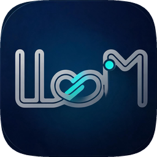
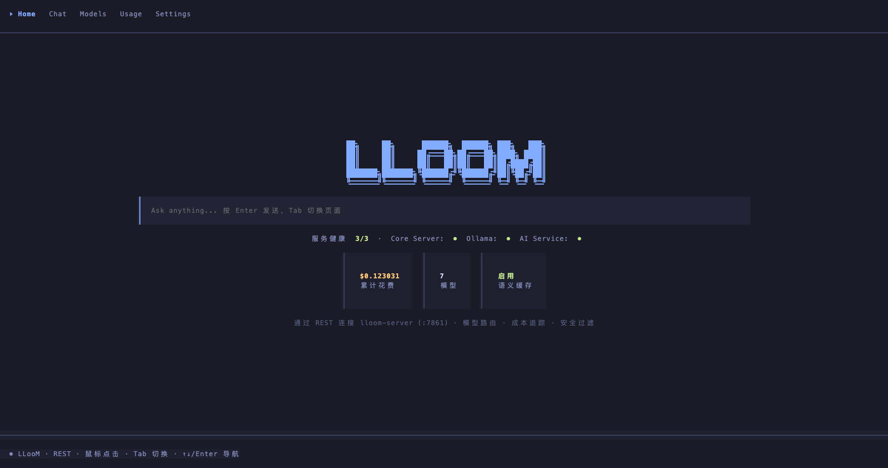

<p align="center">
  
</p>

<h1 align="center">LLooM</h1>

<p align="center">
  A self-hosted LLM routing gateway — one Rust binary that routes, prices, caches and secures your LLM traffic.<br/>
  <strong>Zero Docker. Zero external database. Clone and run.</strong>
</p>

<p align="center">
  
  
  
  
  
  
</p>

<p align="center">
  <strong>English</strong> | <a href="README-ZH.md">中文</a>
</p>

<p align="center">
  
</p>

---

## Why LLooM?

| Pain point | LLooM's answer |
|------------|----------------|
| Juggling models by gut feeling | **Score-based routing** — regex + LLM two-layer classification, cost/quality weighted `plan()` picks the best value model per task |
| API keys stuck in one global Settings page | **Per-model configuration** — each model is explicitly local (Ollama / LM Studio / vLLM) or cloud (provider + API base + API key) |
| Uncontrollable API bills | **Budget-tier routing** — normal/throttle/tight/protect degrade automatically; protect forces zero-cost local fallback |
| Opaque pricing | **Multi-source pricing** — manual > remote > packaged > heuristic chain, cross-checked by live probes and OpenRouter reference prices |
| Paying repeatedly for repeat questions | **Semantic cache** — vector similarity hits return cached replies at zero cost |
| Complex tasks overwhelming one model | **Task orchestration** — auto-decompose, assign a model per subtask, execute, aggregate |
| "Healthy" status that isn't healthy | **Honest status** — real probes distinguish Down / port conflict / missing config; never a fake green light |

## Quick Start

**Option A — download a release**

1. Grab the latest build from [Releases](https://github.com/citrus-dot/LLooM/releases) (or install the `.deb`/`.rpm`)
2. Add models on the **Models** page and set each model's API key there
3. Chat at `http://localhost:7861`

**Option B — from source**

```bash
git clone -b v2 https://github.com/citrus-dot/LLooM.git
cd LLooM

uv sync --extra dev --extra build          # or: pip install -e ".[dev]"
cp .env.example .env                       # API keys are set per-model in the UI; env keys are fallback
cd webui && npm install && npm run build && cd ..

cargo run -p lloom-server                  # Web UI on :7861
```

The server (`:7861`) is the single entry point — it spawns the Python AI micro-service (`:7862`) and Ollama (`:11434`) automatically. Ollama itself is not bundled; install it with `curl -fsSL https://ollama.com/install.sh | sh`.

## Try It

**WebUI** — open [http://localhost:7861](http://localhost:7861): service status, chat, models, usage, pricing, settings.

**CLI**

```bash
lloom-cli chat "Explain quicksort"          # one-shot, auto-routed
lloom-cli usage                             # spend per model
lloom-cli status                            # services + routing stats
```

**REST API** — OpenAI-style streaming:

```bash
curl -N -X POST http://localhost:7861/api/chat/stream \
  -H "Content-Type: application/json" \
  -d '{"q": "Explain quicksort"}'
```

## Features

- **Smart routing** — two-layer classification (regex → LLM fallback); registry-gated scoring with health/budget/cost-cap checks; pinned models as soft prior (`LLOOM_PINNED_MODE=hard` reverts); 5-level fallback chain; shadow evaluation + AIQ offline replay
- **Cost accounting** — per-model token/cost tracking in SQLite; budget tiers injected into routing; monthly probe budget with calibration sentinels
- **Multi-source pricing** — priority chain `manual > overlay > litellm_remote > litellm_packaged > heuristic`; OpenRouter reference prices with ≥20% deviation flags
- **Task orchestration** — complexity detection → LLM decomposition → sequential execution → aggregation, all over SSE
- **Security** — PII masking (7 types), jailbreak interception (5 types), 14-domain MMLU classification
- **Semantic cache** — ChromaDB cosine similarity (0.95 threshold, 24h TTL), hit feedback loop, threshold autotune, graceful degradation
- **Three frontends** — WebUI, CLI (`lloom-cli`), TUI (OpenTUI + SolidJS), all on one REST contract

## Architecture

```
UI layer (WebUI / CLI / TUI)            ← any frontend, UI-agnostic
        │  HTTP REST — typed JSON, the single contract
Rust core + axum REST server (:7861)    ← all business logic + WebUI
        │
Rust core modules (db / router / security / pricing / probe / …)
        │  async HTTP
Python AI micro-service (:7862)         ← stateless litellm wrapper
        │
LLM providers (DashScope / OpenAI / Anthropic / Ollama)
```

- **Rust owns everything**: SQLite (WAL), routing, security, process management — Python is reduced to the one thing Rust can't replace (litellm's 100+ provider coverage)
- **Honest service status**: child process alive + port responding + AI readiness — never a fake "healthy"

Full layer breakdown, ports, and the [REST API reference](ARCHITECTURE.md#rest-api-参考) live in [ARCHITECTURE.md](ARCHITECTURE.md).

## Configuration

All via `.env` (see [.env.example](.env.example)):

| Key | Default | Description |
|-----|---------|-------------|
| `DASHSCOPE_API_KEY` | (empty) | DashScope API key — env fallback; preferred: set per-model in the UI |
| `DASHSCOPE_API_BASE` | `https://dashscope.aliyuncs.com/compatible-mode/v1` | DashScope endpoint |
| `OPENAI_API_KEY` | (empty) | OpenAI API key — env fallback; preferred: set per-model in the UI |
| `OPENAI_BASE_URL` | (empty) | OpenAI base URL override |
| `ANTHROPIC_API_KEY` | (empty) | Anthropic API key — env fallback; preferred: set per-model in the UI |
| `LLOOM_WEB_PORT` | `7861` | Server + Web UI port |
| `LLOOM_AI_SERVICE_URL` | `http://localhost:7862` | Python AI micro-service URL |
| `LLOOM_DATA_DIR` | `./data` | Data directory (SQLite, conversations) |
| `LLOOM_PINNED_MODE` | `soft` | Pinned model: `soft` prior or `hard` appointment |

## Documentation

| Doc | Contents |
|-----|----------|
| [ARCHITECTURE.md](ARCHITECTURE.md) | Layer breakdown, full REST API reference, ports, data flows |
| [TEST-GUIDE.md](TEST-GUIDE.md) | Feature test guide (`bash scripts/smoke_test.sh` covers 19 checks) |
| [ROUTING-PLAN.md](ROUTING-PLAN.md) / [PRICING-PLAN.md](PRICING-PLAN.md) / [CONTEXT-PLAN.md](CONTEXT-PLAN.md) | Design docs for routing / pricing / context |
| [LLooMprogress.md](LLooMprogress.md) | Progress ledger |

## Roadmap

- [x] **OpenAI-compatible proxy** — shipped (N1): `POST /v1/chat/completions` + `/v1/models`, ChatBox / Open WebUI / agent frameworks plug in with zero changes
- [x] **Parallel subtask execution** — shipped (N3.a): independent subtasks run concurrently, results aggregate in order
- [ ] **Prometheus metrics** — `GET /metrics` with per-model/task-type/budget-tier counters
- [x] **Closed-loop weight suggestions** — shipped (N2): offline replay grid search, adopted after human review

<details>
<summary><strong>CLI reference</strong></summary>

```bash
cargo build -p lloom-cli                    # or use target/debug/lloom-cli

lloom-cli models list | add | update | remove
lloom-cli budgets set user default 10 --duration 30d
lloom-cli budgets list | check user default
lloom-cli usage | status
lloom-cli service status | start ollama | stop ai | restart ai | logs ollama
lloom-cli conversation list | show <id> | delete <id> | new
lloom-cli chat "hi"                         # one-shot
lloom-cli chat "continue" --session <id>    # resume
lloom-cli chat "hi" --interactive           # multi-turn
```

</details>

<details>
<summary><strong>TUI</strong> — OpenTUI + SolidJS terminal dashboard</summary>

Five tabs: **Home** (logo + prompt + spend stats), **Chat** (conversation list
+ streaming chat), **Models** (registered models + add form), **Usage** (costs,
model pricing), **Settings** (service addresses + management). Switch with
`Tab`, quit with `Ctrl+C`. Right-click a conversation or service row for
open/delete/log/restart menus.

```bash
cd tui
bun install
bun run src/index.tsx
```

</details>

<details>
<summary><strong>Project structure</strong></summary>

```
LLooM/
├── crates/lloom-core/            # Business core lib (UI-agnostic):
│   │                             #   server.rs, db.rs, router.rs, security.rs,
│   │                             #   pricing.rs, probe.rs, conversations.rs,
│   │                             #   ai_client.rs, processes.rs, health.rs, …
├── crates/lloom-server/          # Main server (REST + WebUI)
├── crates/lloom-cli/             # CLI (clap, links lloom-core)
├── webui/                        # WebUI (React + Vite + Ant Design) → dist/
├── tui/                          # TUI (OpenTUI + SolidJS, bun)
├── api/ai_service.py             # Python AI micro-service (litellm wrapper)
├── scripts/                      # build.sh / smoke_test.sh / aiq_replay.py
└── ARCHITECTURE.md               # Layer breakdown + REST reference
```

</details>

## License

MIT
